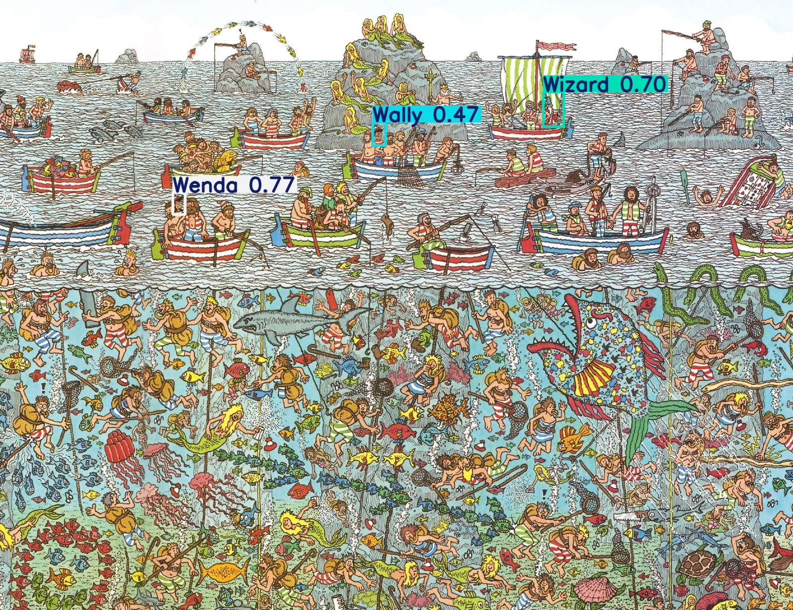

# Where's Wally Object Detection Project

## Project Overview

This project is a full-stack system that uses deep learning to find "Wally" in "Where's Wally?" illustrations.

It features:
- A Command-Line Interface (CLI) for local predictions.
- A Website Interface built with a MERN Stack (MongoDB, Express, React, Node.js) frontend and a Flask backend for running YOLOv11 detections.

The aim was to automate the visual search task and create an accessible, user-friendly solution.

## How to Use — Command-Line Interface (CLI)

### Run a Prediction
1. Open `predict.py`.
2. Change the image path in this line:
   ```python
   image = "your_image.jpg"
   ```
3. Save the file.
4. In the terminal, run:
   ```bash
   python predict.py
   ```

The model will detect Wally, save the output image to the predict folder within the runs folder

## How to Use — Website Interface

### 1. Start the React Frontend
Navigate to the Frontend folder:

```bash
npm install
npm start
```

This will start the website on `http://localhost:3000`.

### 2. Start the Node.js Backend
Navigate to the Backend folder:

```bash
npm install
npm run dev
```

This will run the Node/Express server for handling uploads and communication with Flask.

### 3. Start the Flask Detection Server
Navigate to the Backend folder:

```bash
pip install -r requirements.txt
python server.py
```

This runs the YOLOv11 model server that actually detects Wally.

### Using the Web App
- Open `http://localhost:3000` in your browser.
- Upload a "Where's Wally?" image.
- Click **Find Wally**.
- See the results with bounding boxes drawn around Wally.

## About the YOLOv11 Model

- Trained on a custom "Where's Wally?" dataset created by augmenting real illustrations.
- Data augmentation was crucial to prevent overfitting due to limited examples.
- Training:
  - Model: YOLOv11 Medium (YOLO11m)
  - Epochs: 100
  - Image Size: 640x640
  - Batch Size: 8
  - Device: CUDA-enabled GPU
- Fast real-time performance, optimised for server-side inference.

## Example Detection



## Requirements

- Node.js + npm
- Python 3.8+
- MongoDB (if running the fullstack web version)
- Flask + Ultralytics (YOLOv11)

## Notes

- Adjust API URLs in React if your backend server is hosted differently.
- Environment variables (`.env`) may be needed for API routes.

## Quick Start Summary

| Part | Command |
|------|---------|
| CLI Run | `python predict.py` |
| React Frontend | `npm start` (inside `/client`) |
| Node.js Server | `npm run dev` (inside `/server`) |
| Flask Backend | `python server.py` (inside `/flask_server`) |
